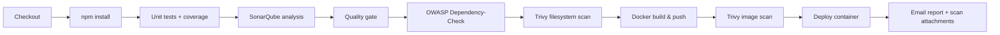

# Netflix Clone — DevSecOps Portfolio Project

A Netflix-style streaming UI built with React and TypeScript, backed by [The Movie Database (TMDB)](https://www.themoviedb.org/) API. The project demonstrates end-to-end **CI/CD** on Jenkins with **security gates**: unit tests, SonarQube, OWASP Dependency-Check, Trivy, and containerized deployment.

---

## Highlights

| Area | What this repo shows |
|------|----------------------|
| **Frontend** | Responsive Netflix-like UX, genre browsing, search, detail modals, video playback |
| **Quality** | Vitest unit tests with coverage wired into SonarQube |
| **Security** | SAST (SonarQube), dependency scanning (OWASP), filesystem & image scanning (Trivy) |
| **Delivery** | Multi-stage Docker build, non-root Nginx runtime, optional Kubernetes manifests |

---

## Application features

- **Home / browse** — Hero banner, carousels, and category rows powered by TMDB discover APIs
- **Genre explore** — Paginated grids with infinite scroll
- **Watch** — Video.js player with custom controls (including YouTube-backed trailers where applicable)
- **Search & navigation** — Netflix-inspired header, routing with React Router v6 lazy-loaded pages
- **State** — Redux Toolkit for API slices and configuration

---

## Tech stack

**Frontend:** React 18, TypeScript, Vite, Material UI, Emotion, Framer Motion, Redux Toolkit, React Router, Video.js  

**Testing:** Vitest, Testing Library, jsdom  

**Runtime:** Nginx (Alpine) serving static `dist` on port **8080**  

**Pipeline & security:** Jenkins, SonarQube Scanner, OWASP Dependency-Check, Trivy, Docker Registry  

**Orchestration (optional):** Kubernetes Deployment + NodePort Service under `Kubernetes/`

---

## DevSecOps pipeline



Pipeline definition: [`Jenkinsfile`](Jenkinsfile)

| Stage | Purpose |
|-------|---------|
| Unit tests | `npm run test:coverage` — feeds LCOV into SonarQube |
| SonarQube | Code smells, bugs, coverage (`sonar-project.properties`) |
| Quality gate | Blocks or warns based on SonarQube policy |
| OWASP FS | Third-party dependency vulnerabilities in the repo |
| Trivy FS | Misconfigurations and vulnerabilities in project files |
| Docker build | Multi-stage image with TMDB key injected at build time |
| Trivy image | OS and library CVEs in the pushed image |
| Deploy | Runs the published image (e.g. host port mapping) |

Build notifications include attached `trivyfs.txt` and `trivyimage.txt` reports.

---

## Container image

The [`Dockerfile`](Dockerfile) uses a **multi-stage** build:

1. **Builder** — `node:22-alpine`, `npm run build` with `VITE_APP_*` variables from build args  
2. **Runtime** — `nginx:stable-alpine`, `apk upgrade` for patched base packages, static assets only, **`USER nginx`**, listens on **8080**

SPA routing is handled in [`nginx.conf`](nginx.conf) via `try_files` → `index.html`.

---

## Prerequisites

- **Node.js** 18+ (22 used in Docker builder)
- **npm**
- **TMDB API key** — create one at [TMDB Settings → API](https://www.themoviedb.org/settings/api)
- For full DevSecOps flow: Jenkins (JDK 17, Node.js tool), SonarQube, OWASP Dependency-Check plugin, Trivy, Docker registry credentials

---

## Local development

```bash
git clone https://github.com/<your-username>/<your-repo>.git
cd <your-repo>

cp .env.example .env
# Set VITE_APP_TMDB_V3_API_KEY in .env

npm install
npm run dev
```

Open the URL Vite prints (typically `http://localhost:5173`).

### Scripts

| Command | Description |
|---------|-------------|
| `npm run dev` | Development server |
| `npm run build` | Typecheck + production bundle |
| `npm run preview` | Preview production build locally |
| `npm run test` | Run Vitest |
| `npm run test:coverage` | Tests with coverage (SonarQube input) |

---

## Docker (local)

Do **not** commit API keys. Pass the TMDB key only at build time:

```bash
docker build \
  --build-arg TMDB_V3_API_KEY=your_tmdb_api_key \
  -t netflix-clone:local .

docker run --rm -p 8080:8080 netflix-clone:local
```

Visit `http://localhost:8080`.

In Jenkins, store `TMDB_V3_API_KEY` as a **credential** and reference it in the build step instead of hardcoding the value in the Jenkinsfile.

---

## Kubernetes (optional)

Manifests in [`Kubernetes/`](Kubernetes/):

- `deployment.yml` — 2 replicas, resource requests/limits, non-root-friendly container port **8080**
- `service.yml` — NodePort exposing the app
- `node-service.yaml` — Node-level service helper

Update the container `image` to your registry tag before applying:

```bash
kubectl apply -f Kubernetes/deployment.yml
kubectl apply -f Kubernetes/service.yml
```

---

## Environment variables

| Variable | Description |
|----------|-------------|
| `VITE_APP_TMDB_V3_API_KEY` | TMDB v3 API key (required) |
| `VITE_APP_API_ENDPOINT_URL` | TMDB base URL (default `https://api.themoviedb.org/3`) |

For Docker, the build arg `TMDB_V3_API_KEY` is mapped into `VITE_APP_TMDB_V3_API_KEY` during `npm run build`.

---

## Project structure

```text
├── src/
│   ├── components/     # UI, player, sliders, modals
│   ├── hooks/          # Custom hooks (+ Vitest tests)
│   ├── pages/          # Home, genre explore, watch
│   ├── store/          # Redux Toolkit slices
│   └── routes/         # React Router configuration
├── Jenkinsfile         # CI/CD + security stages
├── Dockerfile          # Multi-stage production image
├── nginx.conf          # SPA + port 8080
├── sonar-project.properties
├── vitest.config.ts
└── Kubernetes/         # Sample K8s manifests
```

---

## Security notes

- Keep TMDB keys and registry passwords in **Jenkins credentials** or your platform’s secret store.
- Review Trivy and OWASP reports each build; remediate HIGH/CRITICAL findings (e.g. base image package updates via `apk upgrade` in the runtime stage).
- SonarQube coverage focuses on `src/utils` and `src/hooks`; UI layers are excluded from coverage thresholds in `sonar-project.properties` by design.

---

## Acknowledgments

- UI and TMDB integration patterns inspired by community Netflix-clone tutorials and the original [DevSecOps-Project](https://github.com/N4si/DevSecOps-Project) learning material.
- Movie metadata and images © [The Movie Database](https://www.themoviedb.org/) — this project is for educational and portfolio use only.

---

## License

This repository is for **educational / portfolio** purposes. Netflix branding and TMDB content remain property of their respective owners.
